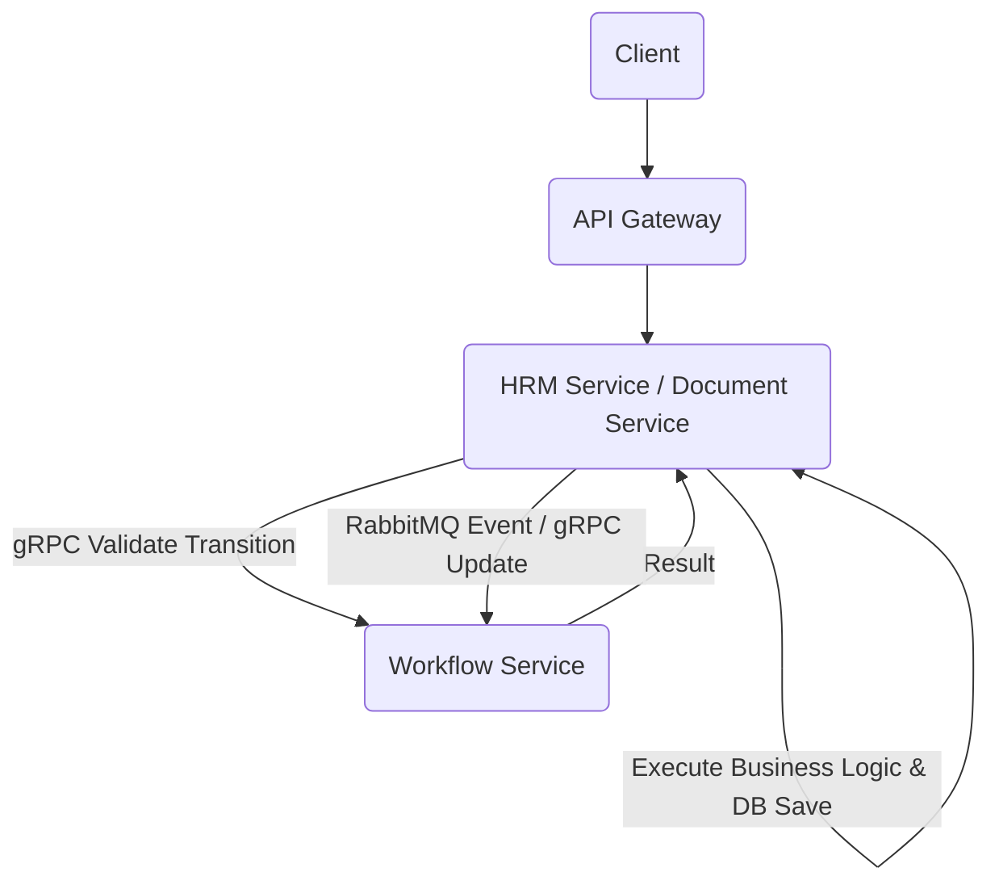

# Workflow Map

Mô hình quản lý quy trình tập trung:

```mermaid
graph TD
    A(Client) --> B(API Gateway)
    B --> C(HRM Service / Document Service)
    C -- gRPC Validate Transition --> D(Workflow Service)
    D -- Result --> C
    C -- Execute Business Logic & DB Save --> C
    C -- RabbitMQ Event / gRPC Update --> D
```
