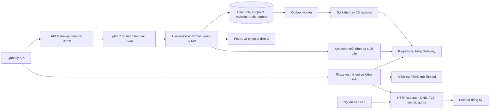

# Kế hoạch tái cấu trúc toàn bộ module quản lý API

Ngày khảo sát: 06/10/2026. Trạng thái: **kế hoạch đã phản biện; chưa triển khai**.

Yêu cầu: tái cấu trúc từ backend đến giao diện; được phép xây lại các phần chưa đạt chuẩn. Việc lập kế hoạch này không xóa dữ liệu, thay đổi backend đang chạy hay thực hiện cắt chuyển production.

## 1. Kết quả cần đạt và phạm vi

Một không gian quản lý API thống nhất, đi xuyên suốt từ đăng ký kết nối, nhập tài liệu, quản lý endpoint, cấu hình xác thực, PBAC/phạm vi đơn vị, thử gọi API, xuất bản đến theo dõi vận hành. Không còn màn hình quảng bá chức năng mà backend chưa hỗ trợ.

Phạm vi khảo sát và thiết kế gồm:

- `apps/user-service/src/modules/integration-config`: nguồn dữ liệu cấu hình hiện tại; schema, audit, gRPC và sự kiện.
- `apps/api-gateway/src/modules/integration`, dynamic proxy, rate limiter và consumer nguồn báo cáo.
- `shared/protos/users/integration.proto` và các contract public liên quan.
- `apps/admin_khcn/features/integration`, `features/gateway`, `features/system-admin/endpoints`, các trang và menu liên quan.
- Schema/seed quản lý Gateway hiện hữu; cấu hình Nginx, RabbitMQ và deployment tại các điểm liên quan đến module.

Không xây lại toàn bộ API nghiệp vụ của HRM, tài liệu, bài viết, workflow hay cơ chế đăng nhập toàn hệ thống. Chỉ sửa consumer của các module này khi contract quản lý API thay đổi. Không biến màn hình này thành trình sửa Nginx hoặc nơi nhập code/script tùy ý.

### Yêu cầu sản phẩm

| Mã | Kết quả bắt buộc |
|---|---|
| FR-01 | Quản lý kết nối có mã ổn định, loại mạng, giao thức, chủ sở hữu, đơn vị, trạng thái và phân trang thật |
| FR-02 | Endpoint là bản ghi riêng theo cặp method/path; có schema tham số, request/response và phiên bản |
| FR-03 | Nhập OpenAPI, Swagger 2, Postman và cURL qua preview/diff/commit có kết quả đúng; không thực thi script |
| FR-04 | Cấu hình xác thực thống nhất với khả năng runtime; secret được quản lý phía server |
| FR-05 | Backend quyết định PBAC và phạm vi tổ chức ở cả REST, gRPC, proxy, test và nguồn báo cáo |
| FR-06 | Thử endpoint đã đăng ký, trả status/thời gian/kết quả giới hạn và đã che dữ liệu; hỗ trợ hủy |
| FR-07 | Lưu nháp, kiểm tra, xuất bản, tắt khẩn cấp và thấy phiên bản đang có hiệu lực |
| FR-08 | Danh mục API nội bộ phản ánh route đang chạy và khai báo quyền; không chỉnh guard chỉ bằng việc sửa metadata |
| FR-09 | Theo dõi revision, đồng bộ gateway, lỗi kết nối, circuit breaker, audit và phụ thuộc |
| FR-10 | Các URL màn hình cũ được chuyển tiếp; nguồn báo cáo và các caller được migrate có kiểm soát |
| FR-11 | Quản lý khóa truy cập đối tác có vòng đời thực nếu phạm vi inbound được xác nhận; không tiếp tục CRUD giả |

Các chuẩn nghiệm thu là chuẩn kỹ thuật nội bộ có kiểm thử; tài liệu này không khẳng định đạt chứng nhận pháp lý hoặc cấp độ ATTT.

## 2. Hiện trạng có bằng chứng

Các nhận định dưới đây đến từ mã nguồn/contract; chưa xác nhận dữ liệu DB production, khả năng khai thác thực tế hoặc hành vi runtime.

| Mã | Bằng chứng | Vấn đề và hệ quả |
|---|---|---|
| E-01 | `features/gateway/api/gateway.api.ts`; tìm kiếm controller trong `apps/api-gateway/src` | UI gọi `/integration/services`, `/routes`, `/apikeys`; chưa tìm thấy handler tương ứng. Schema và seed có model không chứng minh chức năng chạy được |
| E-02 | `features/system-admin/endpoints/api.ts`; trang `system-admin/endpoints` | Vẫn gọi `/roles/endpoints`, `/roles/permissions/matrix`; trang hứa tự quét/gán quyền tức thì, nhưng chưa tìm thấy backend thực thi tương ứng |
| E-03 | `features/integration/api.ts`, `schemas.ts`, `integration.controller.ts`, `upstream.dto.ts`, `upstream-network.ts` | Frontend trộn `protocol` với `type`; runtime chỉ nhận loại mạng `internal/external`; nhiều field nằm trong JSON metadata và DTO `any` |
| E-04 | `integration.prisma`, `integration.service.ts`, `upstream-access.ts` | Paths và methods tách rời nên runtime chấp nhận tích Descartes. Ví dụ chỉ đăng ký GET /a và POST /b vẫn có thể cho POST /a nếu quyền tổng quát đáp ứng |
| E-05 | `registry.service.ts`; `IntegrationConfigController.getSnapshot` | ETag = highestVersion + số bản ghi: sửa một bản ghi version thấp có thể không đổi ETag; xóa/thêm cùng số lượng cũng có thể bỏ sót. Không có global revision bền vững |
| E-06 | `integration-config.service.ts` | Mutation, audit, event không cùng transaction; update đọc version rồi ghi không OCC; list không lọc organization, actor có fallback `system-admin` ở handler |
| E-07 | `integration-config.controller.ts`, `integration.proto` | Handler CRUD/snapshot chưa gắn xác thực nội bộ/PBAC; tổ chức không có trong contract hiện tại. `callerUserId` trong payload không phải bằng chứng danh tính |
| E-08 | `import.dto.ts`, `integration.controller.ts` | Preview đánh dấu xung đột theo hai danh sách rời; commit không dùng conflictStrategy, luôn thử tạo một upstream và vẫn báo success khi errorCount > 0 |
| E-09 | `features/integration/api.ts`, `manager/form/AuthFields.tsx`, `integration.service.ts` | UI lưu auth.config trong khi proxy dùng secretRef; UI có OAuth/Bearer/mTLS nhưng proxy hiện hỗ trợ none/basic/apiKey. Cấu hình lưu được chưa chắc gọi được |
| E-10 | `app/api/integration/test-auth/route.ts`, `proxy.ts` | Route nhận authUrl tùy ý, `rejectUnauthorized: false`, trả token/data thô; không kiểm tra phiên/PBAC tại handler; proxy Next cho `/api` qua. Cần kiểm chứng ingress/basePath, nhưng bản thân handler thiếu kiểm soát |
| E-11 | `integration.service.ts`, `upstream.dto.ts`, `RateLimiterService.check` | Proxy chuyển object rateLimit vào tham số limit:number; schema dùng windowMs/max, import dùng maxRequests. Thuật toán hiện là cửa sổ cố định từ request đầu, dù comment gọi sliding window; Redis lỗi cho qua |
| E-12 | `registry.service.ts` | Có polling nhưng thiếu quản lý shutdown timer; có trường hợp snapshot JSON lỗi bị bỏ qua mà bootstrap vẫn báo ready; event handler nằm ở provider cần kiểm chứng binding và topology queue |
| E-13 | `features/integration/api.ts`, `lib/session-recovery.ts` | Interceptor trả response.data; execute lại đọc res.status/res.data như AxiosResponse, nên có thể mất HTTP metadata hoặc đọc sai payload proxy |
| E-14 | `api-gateway/prisma/schema/gateway.prisma`, seed và `ApiKeysTab.tsx` | Model khóa chứa `key`, UI nhận/hiển thị key; default ignoreTlsVerify=true. Chưa chứng minh có consumer active; không được xóa schema khi chưa inventory dữ liệu/caller |
| E-15 | `modules/reports/report-source.service.ts`, `shared/reporting/table-contract.ts` | Báo cáo đang phụ thuộc tên upstream + path; thay ID/đường dẫn/quyền thiếu adapter sẽ phá báo cáo |

Phần đáng giữ sau kiểm chứng: validation đường dẫn chống traversal, kiểm tra đích DNS khi mở socket, lọc header/cookie của proxy, xác minh token/revocation, circuit breaker, streaming/backpressure và các regression test hiện có. Đây là nền tảng tái sử dụng, chưa phải bằng chứng hoàn tất tất cả kiểm soát.

## 3. Quyết định kiến trúc và phương án thay thế

### 3.1. Phương án khuyến nghị

**Xây lại domain và giao diện của module; giữ topology dịch vụ hiện tại trong đợt đầu.**

- User-service tiếp tục là chủ sở hữu duy nhất của dữ liệu cấu hình tích hợp, endpoint, revision, import session, credential metadata và audit/outbox của module. Tổ chức thành các use case rõ ràng trong module chuyên biệt, không trộn với CRUD người dùng.
- API Gateway sở hữu biên HTTP, kiểm tra phiên, chuyển transport và thực thi HTTP upstream có kiểm soát. Domain CRUD/import resolution/publication thuộc user-service; gateway không ghi DB cấu hình thay user-service.
- PBAC hiện có tiếp tục sở hữu policy/subject/resource/context; module dùng bộ đánh giá này, không tạo hệ phân quyền thứ hai.
- Frontend chỉ render contract đã được chuẩn hóa, quản lý form/query/UI state và hiển thị capabilities từ backend.
- Các API nghiệp vụ nội bộ vẫn dùng controller và gRPC tĩnh. Danh mục route tự quét là dữ liệu quan sát; không biến mọi route nội bộ thành reverse proxy động.

Không tạo generic repository/framework hoặc hệ plugin mới cho một module. Chỉ tách lớp tại những ranh giới có trách nhiệm và kiểm thử độc lập.

### 3.2. Đánh đổi

| Phương án | Lợi ích | Chi phí/rủi ro | Quyết định |
|---|---|---|---|
| Chỉ sửa màn hình và route gọi | Nhanh, ít migration | Giữ nguyên method/path rời, revision sai, CRUD/import/audit thiếu nhất quán | Không đáp ứng mục tiêu |
| Xây lại module trong topology hiện tại | Sửa tận gốc, một chủ dữ liệu, migration gọn hơn | User-service còn phụ trách cấu hình tích hợp; cần module boundary và quota riêng | Chọn cho đợt đầu |
| Tạo integration-service và DB riêng ngay | Cô lập deployment/scaling | Tăng vận hành, di chuyển dữ liệu/caller/secret, thêm failure mode | Chỉ mở ADR nếu tải/đội vận hành chứng minh cần; không tự triển khai |
| Thay bằng Kong/APISIX hoặc gateway chuyên dụng | Có nền tảng routing/quota/plugin | Không thay được nghiệp vụ PBAC/catalog/import; thêm hạ tầng và tích hợp | Đánh giá khi có yêu cầu inbound/traffic lớn; không là điều kiện cho đợt đầu |

Thiết kế giữ contract theo domain để sau này có thể tách service. Không trả chi phí một lần di chuyển hạ tầng khi chưa có nhu cầu được xác nhận.

## 4. Mô hình và contract mục tiêu

Thiết kế chi tiết nằm tại [data-model.md](<../rebuild api manager/data-model.md>) và [contracts.md](<../rebuild api manager/contracts.md>).

- `IntegrationConnection`: id/code bất biến; displayName sửa được; `networkZone` tách khỏi `protocol`; origin/basePath tách nhau; scope tổ chức; draft/published/disabled; configVersion và credential metadata.
- `IntegrationEndpoint`: method + normalized pathTemplate + connection + organization; phiên bản/schema/capabilities riêng. Không tạo quyền bằng cách nhân chéo hai danh sách.
- `IntegrationRevision`: revision tăng bền vững theo phạm vi registry, checksum và snapshot immutable. Bất kỳ publish/disable/delete/credential policy change ảnh hưởng traffic đều tạo revision mới.
- `IntegrationImportSession`: preview/diff đã chuẩn hóa, input hash, phiên bản đích, TTL và kết quả commit/idempotency.
- `IntegrationAudit` và `IntegrationOutbox`: ghi cùng mutation trong một transaction; không lưu token/body nhạy cảm; publish sự kiện ngoài transaction.
- `CredentialBinding`: opaque reference do server cấp, loại xác thực, version, trạng thái; không cho admin tùy chọn tên biến môi trường bất kỳ để đọc secret toàn ứng dụng.
- `InternalApiOperation`: danh mục route từ manifest build/scan kèm service/resource/action/public marker. Mapping có thể quan sát và quản lý theo cơ chế backend đã thiết kế; không cho sửa metadata để làm public hoặc bỏ guard.
- Nếu inbound được chốt: `ApiConsumer` và `ApiAccessKey` với scope endpoint, đơn vị, hash, hạn dùng, thu hồi/rotation và quota. Khóa inbound khác credential outbound.

HTTP quản trị dùng prefix `/api/v1/admin/api-management`, envelope thống nhất; proxy streaming giữ payload HTTP riêng. Proto v2 được bổ sung cạnh proto hiện hữu, giữ field number cũ và adapter trong thời gian migration. PATCH dùng presence rõ ràng; không lấy mặc định protobuf làm lệnh xóa field.

## 5. Bảo mật, phân quyền và xử lý lỗi

### 5.1. Quyền và scope

- Tách actions xem, tạo/sửa, nhập, thử gọi, xuất bản, tắt, quản lý credential và xem audit. `MANAGE` hiện hữu chỉ được ánh xạ theo migration matrix được duyệt, không tự cấp quyền rộng hơn.
- Scope có ba dạng rõ ràng: đơn vị sở hữu, tập đơn vị được chia sẻ, toàn nền tảng. Toàn nền tảng cần policy riêng; không dùng `DEFAULT` hoặc organizationId do browser gửi làm căn cứ quyền.
- Xác minh actor và service identity trong metadata/token gRPC hiện có; payload callerUserId chỉ là tương thích, không được dùng để tin danh tính. Đọc/list/snapshot cũng cần authorization; snapshot là quyền service riêng, không mở cho mọi actor.
- CRUD phải lọc scope tại truy vấn; kiểm tra actor/resource/context trong service sở hữu dữ liệu. Thiếu scope hoặc không đánh giá được quyền thì từ chối.
- Proxy/test/report cùng dùng endpoint resolution và authorization semantics. Không cache allow quyết định lâu hơn SLA thu hồi đã chốt; đánh giá quyền hiện hành khi execute, ngay cả khi cấu hình đã được publish.
- Danh mục API nội bộ không tự động đánh dấu route chưa có metadata là public. Có gate kiểm kê public/private; endpoint thuộc module này thiếu policy sẽ không phát hành.

### 5.2. HTTP và secret

- Tất cả lượt gọi, bao gồm test OAuth, dùng executor được bảo vệ: đích có trong cấu hình, HTTPS cho external, TLS verification bật, CA nội bộ được cấu hình riêng; không có switch bỏ kiểm tra chứng chỉ.
- Kiểm tra domain/IP/port được phép cho internal; loại mạng internal không đồng nghĩa được gọi mọi địa chỉ riêng. Chặn metadata endpoint, loopback, IPv4/IPv6 đặc biệt, DNS rebinding, redirect và credential-in-URL.
- Credential cần provision theo channel được phép: environment/secret manager với danh mục reference được cấp sẵn cho MVP. Nếu cần nhập/rotate từ UI, thiết kế kho mã hóa/secret manager và write-only endpoint trước; không đưa secret vào auth JSON hay form nạp lại.
- UI auth options lấy từ backend capabilities. Runtime hiện thiếu Bearer/OAuth/mTLS: triển khai none/basic/apiKey/Bearer theo target contract; OAuth client credentials cần token lifecycle, refresh single-flight, TTL và clock-skew. mTLS chỉ bật sau khi quản lý cert/CA/rotation được kiểm chứng; dữ liệu cũ chưa hỗ trợ phải bị khóa publish với lý do rõ ràng.
- cURL chỉ parse bằng parser giới hạn; Postman scripts không chạy; `$ref` ngoài tài liệu không được tự fetch. URL-import là mở rộng có gate SSRF, không mặc nhiên bật do importer có URL.
- Test write endpoint có cảnh báo tác động và thao tác xác nhận tại UI, nhưng backend vẫn enforce quyền. Retry mặc định tắt cho write; chỉ retry khi semantics và idempotency upstream cho phép. Timeout write là kết quả chưa xác định, không báo chắc chắn thất bại hay tự gửi lại.
- Không trả OAuth token/raw secret trong test result; giới hạn response bytes, nesting, thời gian, concurrency và redaction. Content nhận về hiển thị dạng text/JSON an toàn, không render HTML/script.
- Credential thiếu, permission service lỗi, snapshot quá cũ hoặc Redis quota lỗi: fail closed với lỗi có mã ổn định cho module; không đổi chính sách fail-open của toàn hệ thống ngoài phạm vi.

### 5.3. Vận hành và failure behavior

- Global revision không phụ thuộc max version từng connection. Polling có fallback cho event mất, checksum và revision monotonic; snapshot mới được validate/build hoàn chỉnh rồi mới atomic swap.
- Giữ snapshot hợp lệ gần nhất trong TTL có cấu hình; từ chối snapshot sai schema/revision cũ, giữ nguyên bản đang dùng và báo degraded. Vượt TTL thì ngừng traffic của module. Disable/revoke có đường deny khẩn cấp để không chờ polling thông thường.
- Event outbox giao ít nhất một lần; consumer idempotent, xử lý trùng/out-of-order, reconcile qua snapshot. Dùng broadcast tới mọi gateway instance; không để một queue cạnh tranh làm chỉ một replica nhận cập nhật. Worker có retry bounded/backoff/dead-letter và điều kiện replay.
- Registry có max connections/quota toàn gateway, drain pool cũ sau request đang chạy, timer shutdown và xử lý request abort. Không cấu hình 100 socket mỗi connection vô hạn.
- Rate limit typed `{ maxRequests, windowSeconds }`; thuật toán cửa sổ cố định được mô tả đúng trong MVP; đổi sang token bucket/sliding window chỉ khi SLO cần. Quota key dùng principalId + organization + endpoint, không IP thay danh tính.
- Caching tắt mặc định. Chỉ GET được whitelist, key chứa đơn vị/principal hoặc scope quyết định, params, endpoint/schema revision; không cache response có secret/dữ liệu cá nhân hay chia sẻ dữ liệu khác scope.
- Phân biệt 401 phiên ứng dụng với lỗi xác thực đối tác; upstreamStatus nằm trong kết quả test, không kích hoạt refresh/logout Hub. HTTP quản trị có mã validation/conflict/dependency stable, không lộ stack/hostname/secret.
- Theo dõi active/desired revision từng replica, độ trễ đồng bộ, timeout/error/429, breaker, outbox lag và latency. Audit quản trị ghi actor/scope/action/target/version/correlation, không ghi body response thô.

## 6. Giao diện xây lại

Tạo feature `features/api-management` thống nhất; tái sử dụng Shadcn/design system hiện có, tránh tạo bộ CSS tùy ý. Text tiếng Việt có dấu; HTTP methods và thuật ngữ giao thức giữ nguyên khi cần.

| Màn hình | Nội dung và hành vi |
|---|---|
| Tổng quan | Số liệu backend, cảnh báo cấu hình chưa hợp lệ, revision mong muốn/đang áp dụng; lỗi không hiển thị như số 0 |
| Kết nối | Bảng phân trang server, search/filter URL, mã/tên/đơn vị/trạng thái/xác thực/phụ thuộc; capabilities điều khiển thao tác |
| Chi tiết kết nối | Tabs: thông tin, endpoint, xác thực, quyền/phạm vi, vận hành, lịch sử; hiển thị nháp và phiên bản đang có hiệu lực |
| Danh mục endpoint | Method/path/operation/schema/trạng thái/quyền; phân trang/lọc phía server; không chỉ đọc `_parsedEndpoints` |
| Nhập API | Chọn dữ liệu → preview → xử lý xung đột theo từng operation → commit nháp → validation/publish; giữ form sau lỗi |
| Thử API | Endpoint đã đăng ký; params/body từ schema; secret không hiện; trạng thái đang chạy/hủy/lỗi/response truncation; thời gian/status thật |
| API nội bộ | Danh mục từ manifest, đánh dấu public/private, resource/action thiếu; chỉ cho sửa những mapping backend thực sự thực thi |
| Khóa đối tác | Vòng đời cấp một lần/rotate/revoke/expiry/quota và scope nếu G-02 xác nhận inbound; nếu chưa chốt thì ghi rõ chưa khả dụng |
| Vận hành và audit | Revision từng gateway, timestamp đồng bộ, dependency health, audit lọc/phân trang, dữ liệu đã che |

Trang dùng RSC lấy dữ liệu đầu tiên với auth context, hydration cho React Query; dữ liệu nhạy cảm không vào shared cache. Query keys gồm scope/filter/page; invalidate đúng connection/endpoints/revisions sau mutation. Các tab không nhìn thấy không fetch dataset lớn. Tách UI state khỏi contract, không tự quyết định quyền/import conflict/publication.

Đủ loading/empty/error/retry/forbidden/pending/success; keyboard/focus/labels, responsive 360/768/1280 px; không lồng nhiều dialog. Editor lớn dùng trang chi tiết hoặc sheet, không tạo chuỗi popup che nhau. Deep link/tab/filter có thể phục hồi sau reload; giữ unsaved changes có cảnh báo rời trang.

## 7. Giữ, thay thế và loại bỏ

| Thành phần | Hành động |
|---|---|
| Token issuer/session/revocation hiện có | Giữ contract; bổ sung context vào module và regression test |
| DNS/path/header protection và breaker hiện có | Tái sử dụng sau test; tách executor dùng chung proxy/test/report |
| integration-config controller/service | Xây lại typed use cases + PBAC/scope/OCC/transaction/outbox |
| integration.proto hiện tại | Giữ adapter tạm; thêm v2 typed, migrate consumer rồi mới retire |
| `_uiConfig`, `_parsedEndpoints`, auth JSON tự do | Import/migrate sang mô hình riêng; dữ liệu không xác định đưa vào quarantine |
| Ba vùng frontend integration/gateway/endpoints | Thay bằng feature mới; giữ URL/menu chuyển tiếp trong kỳ tương thích |
| Next.js test-auth trực tiếp | Chặn đường cũ khi triển khai containment, thay backend execute có quyền; không giữ bypass TLS |
| Nginx editor và route CRUD chưa có backend | Không dựng CRUD giả để khớp UI; chuyển cấu hình ingress sang deployment versioned |
| GatewayService/GatewayRoute/ApiKey schema + seed | Inventory dữ liệu/caller; migrate hoặc archive có bằng chứng rồi mới xóa code/schema ở phase cuối |
| Report source consumer | Adapter sang connection/endpointId + revision; giữ đọc định nghĩa cũ và đo số consumer còn lại |

## 8. Các giai đoạn thực hiện và gate

Danh sách task có thứ tự, dependency, vùng file và tiêu chí riêng ở [tasks.md](<../rebuild api manager/tasks.md>). Không có task nào được đánh dấu hoàn thành bởi việc lập kế hoạch.

| Giai đoạn | Công việc | Điều kiện qua gate |
|---|---|---|
| P0: baseline và containment | Inventory caller/data/routes/public paths; fixtures; khóa đường test-auth nguy hiểm và validate contract cũ tại module | Baseline có bằng chứng; route bị chặn không gọi mạng/không trả secret; không hồi quy đăng nhập |
| P1: contract và schema | Chốt G-01..G-05, proto v2, HTTP schema, permission matrix, model/index, migration additive | DTO/proto/public schema thống nhất; mapping dữ liệu cũ không mở rộng quyền; compatibility test qua |
| P2: backend quản trị | CRUD/list/scope/OCC, draft/publish, import, audit/outbox, credential references | Trực tiếp gọi gRPC không bypass; mutation/audit/outbox atomic; idempotency và conflict đúng |
| P3: runtime và đồng bộ | Snapshot/revision/broadcast, HTTP executor, auth adapters, quota/deadline/redaction | Tất cả replica đồng bộ; method/path chính xác; proxy/test/report cùng policy; fault tests qua |
| P4: giao diện và consumer | Feature mới, RSC/query/form, endpoint explorer, import wizard; adapter report/menu/URL | Luồng end-to-end chạy thật; không gọi route giả, không quyền authoritative ở client, không token lộ |
| P5: inbound có điều kiện | ApiConsumer/key cấp/rotate/revoke/scope/quota và partner authentication | G-02 chốt và trust boundary test qua; nếu chưa chốt không đưa chức năng này vào bản phát hành |
| P6: rehearsal và cutover | Backfill dry-run, reconcile, staging/fault/load, canary, rollback drill | Không mất dữ liệu/phụ thuộc; đạt SLO đã chốt; rollback vẫn giữ deny/revocation |
| P7: dọn legacy và vận hành | Retire adapter/schema sau cửa sổ tương thích; tài liệu/hồ sơ ATTT; runbook | Legacy traffic/reference bằng 0 theo cửa sổ đã chốt; backup restore thử được; hồ sơ khớp thực trạng |

P0..P4 là baseline chức năng mới. P6 là gate phát hành, P7 là điều kiện hoàn tất tái cấu trúc. Không coi UI đã chạy là hoàn thành backend hoặc module.

### Các quyết định cần chốt trước bước phụ thuộc

| Gate | Quyết định | Chủ chốt | Mặc định an toàn và công việc tiếp tục được |
|---|---|---|---|
| G-01 | Có cần tách integration-service/DB ở đợt này không? | Kiến trúc + vận hành + chủ sản phẩm | Giữ owner user-service; nếu yêu cầu tách phải sửa ADR/migration/deployment trước P1 |
| G-02 | Có cấp quyền inbound cho đối tác không? Đối tác nào, endpoint/data scope nào? | Chủ sản phẩm + chủ dữ liệu + ATTT | Chưa bật inbound; tiếp tục outbound/catalog và P0..P4 |
| G-03 | Dữ liệu hiện hành, consumer, đơn vị sở hữu và mapping policy legacy | Chủ dữ liệu + DBA + chủ module | Dry-run/quarantine; không tự chuyển `DEFAULT` thành global; chặn P6 nếu chưa được duyệt |
| G-04 | Secret backend, auth kinds cần ngay, trusted origins/ports/CA | Vận hành + ATTT + chủ hệ thống tích hợp | Approved references; không nhận arbitrary env ref, không bỏ TLS verification |
| G-05 | Quota/SLO, SLA disable/revoke, snapshot TTL, retention, cửa sổ tương thích và rollback | Vận hành + chủ sản phẩm + ATTT | Chỉ dùng giá trị staging thử nghiệm; chưa khẳng định đạt production |

Đây là decision gate cho triển khai, không yêu cầu người dùng trả lời để hoàn thành bản kế hoạch này. Không cần thêm quyền để lập tài liệu hoặc khảo sát đọc mã.

## 9. Migration và rollback

1. Chụp baseline số lượng/checksum/reference trên dữ liệu được phép; backup và thử restore trước backfill. Không dùng `.env`/DB production trực tiếp trong test.
2. Thêm bảng/field/contract v2, giữ dữ liệu/contract v1. Việc chạy migration thực tế phải theo quy trình môi trường đích; không `migrate reset`, không xóa bảng để xây lại.
3. Migration tool có dry-run/idempotency/checkpoint/reconciliation: metadata endpoint có cặp đúng thì chuyển; chỉ có danh sách paths/methods rời không được tự nhân chéo, phải quarantine/chủ module xác nhận.
4. Giữ UUID/code alias ổn định cho connection; displayName không là route key. Backfill owner/scope dựa dữ liệu xác nhận, không tự mở quyền hoặc đoán organization.
5. Chuyển auth.config/raw credential sang reference qua kênh provision được duyệt; không log secret trong dry-run. Các key plaintext legacy cần đánh giá rotate/reissue, không coi việc hash lại là xử lý xong nguy cơ đã lộ.
6. Chọn một write owner v2; adapter v1 chuyển lệnh vào cùng use case và OCC/idempotency. Không dual-write hai cơ sở dữ liệu hoặc hai service. Caller v1 thiếu presence/version cần adapter có semantics rõ hoặc trở thành read-only trước cắt chuyển.
7. Shadow kiểm tra resolution/policy không thực hiện write/test mạng lần thứ hai; so sánh catalog và quyền offline. Canary theo connection/đơn vị trên staging, sau đó nhóm production được duyệt.
8. Migrate reference báo cáo/consumer sang stable IDs theo lô, vẫn đọc định nghĩa cũ qua alias được kiểm soát. Disable/delete hiển thị dependency và bị chặn khi còn tham chiếu; archive thay hard-delete thường xuyên.
9. Rollback code/feature flag về adapter đã kiểm chứng trên schema additive; traffic write phải đóng hoặc chỉ vào executor an toàn. Không rollback về test-auth TLS bypass hay policy rộng cũ. Deny/revocation journal bền vững ngoài snapshot phải luôn được áp dụng.
10. Sau cửa sổ tương thích được G-05 chốt, chứng minh zero legacy caller/reference, archive rồi mới drop schema/adapter. Drop không nằm trong rollback tức thì; phải có backup và kế hoạch restore riêng.

## 10. Nghiệm thu và kiểm chứng

Hướng dẫn chạy và tình huống chi tiết: [quickstart.md](<../rebuild api manager/quickstart.md>).

| Mã | Kiểm chứng bắt buộc | Tiêu chí đạt |
|---|---|---|
| AC-01 | Đối chiếu UI ↔ HTTP ↔ gRPC ↔ schema | Tất cả thao tác hiển thị có handler/contract thật; không fallback thành thành công hoặc mảng rỗng khi request lỗi |
| AC-02 | 2 đơn vị + user không quyền + spoof actor/scope | Không đọc/sửa/execute/audit khác scope ở REST/gRPC/proxy/report; user không quyền không được phát hiện chi tiết nguồn |
| AC-03 | GET /a, POST /b, GET /a/{id}, route trùng/mã hóa path | POST /a và GET /b bị từ chối; route template/priority xác định, không traversal/wildcard mở rộng |
| AC-04 | Preview/overwrite/skip, commit lại, snapshot đích thay đổi | Diff đúng theo connection+method+path; commit atomic; cùng idempotency trả cùng kết quả, stale version 409 |
| AC-05 | 2 update đồng thời + crash sau commit trước publish | Một update thắng, một conflict; audit/outbox không mất; replay event không tạo revision/mutation trùng |
| AC-06 | Sửa bản ghi version thấp, xóa/thêm cùng count, event mất/trùng/đảo | Revision tăng đúng; mọi replica converge qua poll, snapshot sai không thay bản hợp lệ |
| AC-07 | SSRF/DNS/redirect/TLS, route test-auth cũ | Không gọi đích cấm, TLS sai bị từ chối; route cũ không trả token hoặc gọi mạng tùy ý |
| AC-08 | None/basic/apiKey/Bearer/OAuth và unsupported auth | UI chỉ bật khả năng đã kiểm thử; secret/token không có trong list/detail/test/audit/log/SSR cache |
| AC-09 | Quota/Redis mất, timeout, response quá lớn, client abort | Lỗi ổn định/Retry-After đúng; không retry write mù; stream có giới hạn và cleanup |
| AC-10 | Endpoint test trả partner 401/403 | Hiển thị upstreamStatus đúng, không logout/refresh phiên Hub vì lỗi đối tác |
| AC-11 | Browser E2E desktop/mobile/keyboard | CRUD/import/publish/test/disable/history dùng backend thật; đủ trạng thái; link cũ chuyển tiếp đúng |
| AC-12 | Nguồn báo cáo/schema/reference cũ | Kết quả và scope giữ đúng semantics; kết nối bị tắt/thu hồi không tiếp tục được dùng để báo cáo |
| AC-13 | Migration + rollback drill | Counts/checksums/reference khớp; quarantine có người xử lý; rollback không mở lại secret/quyền đã thu hồi |
| AC-14 | Gate inbound khi được triển khai | Key chỉ trả một lần; DB lưu hash; scoped principal; hết hạn/revoke/rotate áp dụng trong SLA đã chốt |

Mốc staging đề xuất để đo, chưa là cam kết production: 1.000 connection × 100 endpoint; list phân trang 50 bản ghi; không full-load client; soak 30 phút với concurrency 50 qua upstream giả lập. Đo heap/socket/query count/CPU, p95 list và overhead proxy trước/sau; chủ vận hành chốt ngân sách theo hạ tầng và tải thực trước P6. SLA revoke/disable có con số riêng tại G-05, không được thay bằng nhận định “hiệu lực ngay”.

## 11. Phản biện sau khi lập kế hoạch

Phản biện bằng lượt rà soát riêng trên kế hoạch và bằng chứng nguồn; không tuyên bố đã có reviewer độc lập hoặc subagent.

| Mức độ | Vấn đề/giả định bị phản biện | Ảnh hưởng | Điều chỉnh trong kế hoạch hoặc lý do giữ nguyên |
|---|---|---|---|
| Blocking | Gom UI nhưng giữ hai authority Gateway DB/User DB | Cấu hình có thể sửa mà traffic không đổi | Một write owner tại user-service; inventory/migrate Gateway schema trước retire |
| Blocking | Tự ghép paths × methods lúc backfill | Mở rộng quyền ngoài ý định | Quarantine dữ liệu thiếu cặp; AC-03/AC-13 bắt buộc |
| Blocking | Snapshot stale làm disable/revoke đến chậm | Tiếp tục truy cập dữ liệu đã bị thu hồi | Deny khẩn cấp + current PBAC + TTL; chốt SLA G-05 và test nhiều replica |
| Blocking | CallerUserId và organization do payload quyết định | Giả mạo actor/đơn vị, gọi thẳng gRPC | Metadata có danh tính xác minh, service authorization, scope từ backend |
| Major | Tách service mới ngay vì muốn “đạt chuẩn” | Tăng failure mode/cutover khi chưa có dữ liệu tải | Giữ topology hiện tại; phương án tách phải có ADR và sửa kế hoạch |
| Major | Atomic swap registry nhưng đóng pool đang có request | Request đang chạy lỗi, socket leak | Build trước, drain pool sau; lifecycle/abort/soak test |
| Major | Import commit chỉ dựa preview browser | Preview bị sửa, ghi đè race hoặc báo thành công giả | Session/hash/server diff + expectedVersion + transaction/idempotency |
| Major | Một execute dùng chung nhưng trộn proxy stream và test JSON | Mất status, interceptor session hiểu sai partner 401 | Executor chung, transport adapter riêng; AC-10 và contract envelope riêng |
| Major | UI quảng bá OAuth/mTLS mặc dù backend chưa có | Cấu hình giả thành công, gián đoạn partner | Capability matrix; OAuth adapter có lifecycle; mTLS bị gate |
| Major | Cho browser chọn env secretRef bất kỳ | Truy xuất secret ngoài phạm vi module | Reference opaque và quyền binding, approved catalog; không arbitrary env lookup |
| Major | Rollback về logic legacy chứa TLS bypass/phân quyền rộng | Khôi phục lỗ hổng, bỏ revoke | Rollback chỉ qua adapter an toàn; giữ deny journal, có chế độ đóng traffic |
| Major | Key inbound bị nhầm với credential gọi đối tác | Trust boundary sai, phạm vi vượt quyền | Model/luồng riêng; G-02; AC-14 |
| Major | Consumer báo cáo còn dùng name/path | Hỏng định nghĩa lưu trữ, thay đổi data scope | Alias + migration reference + dependency checks, AC-12 |
| Minor | Nâng thuật toán quota/hạ tầng ngay không có SLO | Phình phạm vi | MVP fixed window mô tả đúng; nâng cấp khi benchmark/chủ vận hành yêu cầu |

### Kết luận phản biện

- Kế hoạch đủ để triển khai P0 và thiết kế P1; các bước phụ thuộc G-01..G-05 phải chốt trước khi triển khai phần tương ứng. Không còn giả định bị che giấu để executor tự quyết định ownership/production risk.
- Worst case cần diễn tập: migration mở rộng quyền, write upstream timeout nhưng đã commit, registry stale khi revoke, secret lộ trong preview/audit, sự kiện chỉ tới một replica, rollback bật lại bypass. Các trường hợp này đều có gate và test riêng.
- Best case: xây lại module trong topology hiện tại, tái sử dụng guard/network/session đã kiểm chứng, cắt chuyển từng connection; tránh di chuyển hạ tầng khi chưa cần.
- Trong 5 năm: stable IDs/versioned contracts/module boundary tạo đường tách service; không phụ thuộc metadata UI, tên hiển thị hoặc vendor gateway để định nghĩa domain.

## 12. Hồ sơ kế hoạch và tình trạng kiểm tra

- Bộ tài liệu chính để agent triển khai và rà soát: `docs/rebuild api manager/`, đọc `README.md` trước rồi `plan.md`. Bản lưu tại `docs/plans/api-management-rebuild.md` và bản handoff `IMPLEMENTATION_PLAN.md` đồng bộ nội dung, chỉ điều chỉnh đường dẫn liên kết theo vị trí file.
- Gói đặc tả chính: `docs/rebuild api manager/{spec.md,research.md,data-model.md,contracts.md,tasks.md,quickstart.md}`. Bổ sung `review-checklist.md`, `acceptance-evidence.md`, `execution-log.md` để kiểm tra và ghi bằng chứng. Các file trong `specs/002-api-management-rebuild/` là chỉ dẫn tương thích tới bộ tài liệu chính; không duy trì thiết kế/task riêng ở đó.
- Đã đọc charter, blacklist, kiến trúc, module docs, skill planning/critique, gateway/PBAC/frontend/NestJS/gRPC/Prisma và hướng dẫn dossier. Áp dụng cấu trúc Spec Kit; checkout thiếu `.specify`, setup scripts/template/constitution được skill tham chiếu nên tạo artifact trực tiếp, không tuyên bố đã chạy CLI/hook tự động.
- Mã nguồn, schema, proto và consumer đã được đối chiếu bằng đọc/tìm kiếm. Các test hiện hữu được inventory nhưng **chưa chạy** trong tác vụ chỉ lập kế hoạch. Không xác nhận build/runtime/SLO hay DB production.
- Khi triển khai thay đổi kiến trúc/luồng, cập nhật hồ sơ ATTT theo skill và phạm vi hồ sơ được duyệt; không mô tả thiết kế tương lai thành hiện trạng đã triển khai. Không tự suy ra cấp độ hoặc trích dẫn pháp lý chưa xác minh.
- Chưa gọi executor/Gemini và chưa triển khai code; không yêu cầu cài model/plugin để hoàn thành công việc lập kế hoạch. Roadmap không được đánh dấu hoàn thành theo tài liệu đề xuất này.

### Tài liệu kỹ thuật đối chiếu

Mô hình operation gắn method trong từng path và schema được đối chiếu theo [OpenAPI 3.1.1](https://spec.openapis.org/oas/v3.1.1.html). Đây là phiên bản tham chiếu thiết kế, không khẳng định là phiên bản mới nhất; importer phải công bố rõ phiên bản hỗ trợ và từ chối phiên bản không hỗ trợ. Validation runtime phải dùng DTO/schema thật, theo [NestJS Validation](https://docs.nestjs.com/techniques/validation). Kiểm soát đích/redirect/DNS được đối chiếu với [OWASP SSRF Prevention](https://cheatsheetseries.owasp.org/cheatsheets/Server_Side_Request_Forgery_Prevention_Cheat_Sheet.html).
