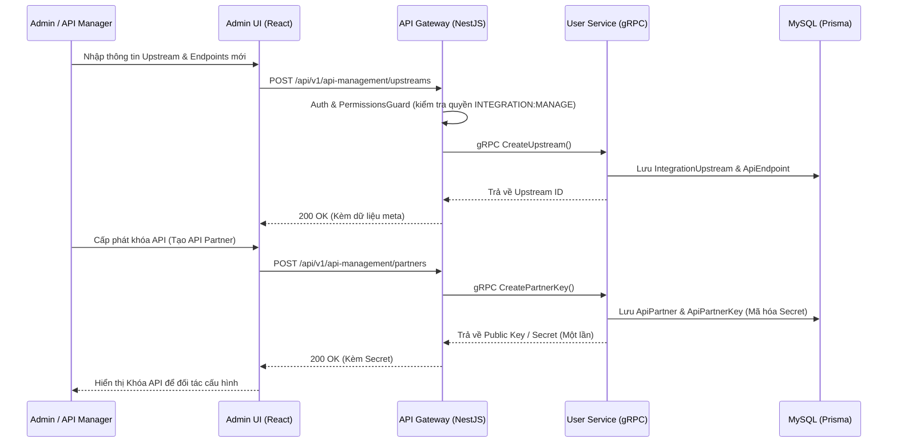
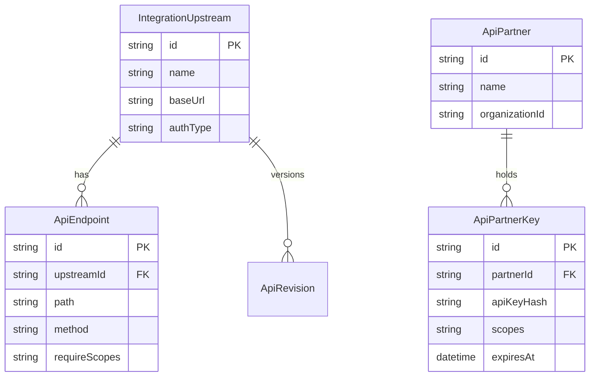
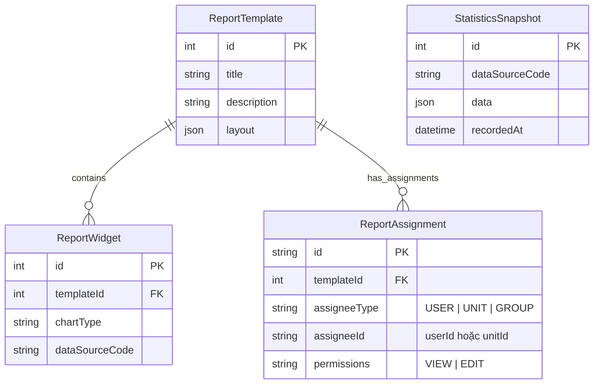
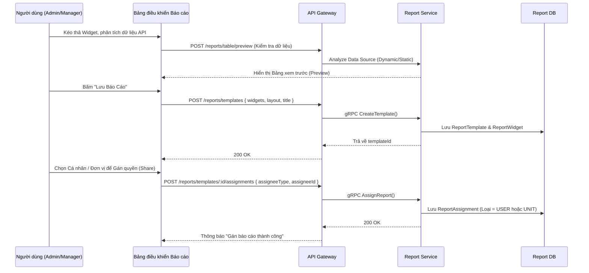
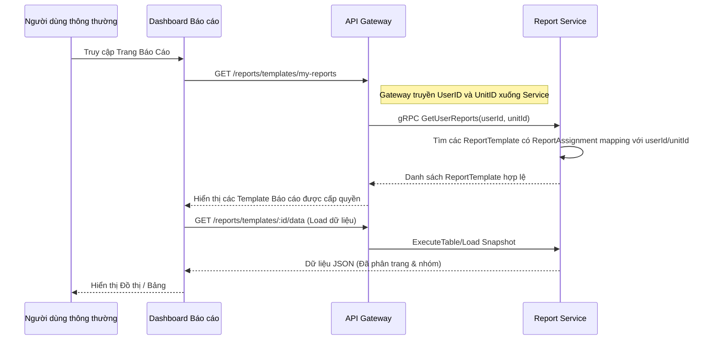

# Tài liệu Rà soát, Đánh giá Hệ thống API và Thiết kế Báo cáo

Tài liệu này trình bày kết quả rà soát, bản vẽ các luồng nghiệp vụ tạo API, đánh giá kiến trúc hệ thống API (API Gateway & API Management), cùng với thiết kế luồng nghiệp vụ tạo, lưu trữ và gán báo cáo (Report Assignments) cho từng cá nhân và đơn vị sử dụng trong hệ thống Daklak Workspace.

---

## 1. Rà soát và Luồng Nghiệp vụ Tạo API (API Management)

Hệ thống quản lý API (API Management) được đặt tại `user-service` kết hợp với `API Gateway` để xử lý khai báo Inbound/Outbound, quản lý phiên bản (Revision) và cấp phát khóa (API Partner/Consumer).

### 1.1. Luồng Nghiệp vụ Khai báo và Tạo API

### 1.2. Bảng Mô tả Dữ liệu Hệ thống API (ERD)

### 1.3. Đánh giá Hệ thống API
- **Bảo mật 3 Lớp (Defense in Depth)**: Hệ thống sử dụng SecurityMiddleware (Anti-DDoS, IP blocklist), JwtAuthGuard (RS256 + Redis JTI Denylist), và PermissionsGuard. Đây là kiến trúc rất mạnh mẽ, giảm tải xử lý cho Backend.
- **Khả năng Mở rộng (Scalability)**: Tách bạch rõ ràng Gateway (nhẹ, xử lý I/O HTTP) và Core Services (chạy gRPC, tương tác DB).
- **Chính sách Quyền riêng tư (Data Sovereignty)**: Gateway không tương tác DB, không làm rò rỉ dữ liệu nhạy cảm của các service nội bộ.
- **Khuyến nghị**: Đối với tính năng Rate Limit cho API Inbound, cần đảm bảo sử dụng Quota linh hoạt theo từng `ApiPartner` (Consumer-based rate limiting) thay vì chỉ IP/User hiện tại.

---

## 2. Thiết kế Luồng Nghiệp vụ Báo cáo & Phân quyền Báo cáo

Theo thiết kế hiện tại, `report-service` đã có khả năng tạo `ReportTemplate`, `ReportWidget` và nhận `StatisticsSnapshot`. Để đáp ứng yêu cầu **"gán báo cáo cho từng cá nhân, đơn vị sử dụng"**, chúng ta cần bổ sung thêm khái niệm **Report Assignment** (Phân quyền Báo cáo).

### 2.1. Đề xuất Lược đồ Dữ liệu (ERD Bổ sung cho Báo cáo)

### 2.2. Luồng Nghiệp vụ Lưu Mẫu Báo cáo và Gán Quyền

### 2.3. Luồng Tải Báo cáo cho Cá nhân/Đơn vị (Đọc dữ liệu)

## 3. Tổng kết Hành động Kế tiếp (Action Items)

1. **Cập nhật Schema**: Thêm model `ReportAssignment` vào `schema.prisma` của `report-service`.
2. **Triển khai gRPC**: Thêm RPC `AssignReport` và `GetMyAssignedReports` vào `report.proto`.
3. **Cập nhật Gateway & UI**: Tạo giao diện cho phép chọn danh sách Nhân viên/Đơn vị (`user-service` cung cấp) và gọi API phân quyền trên trang quản lý báo cáo.
